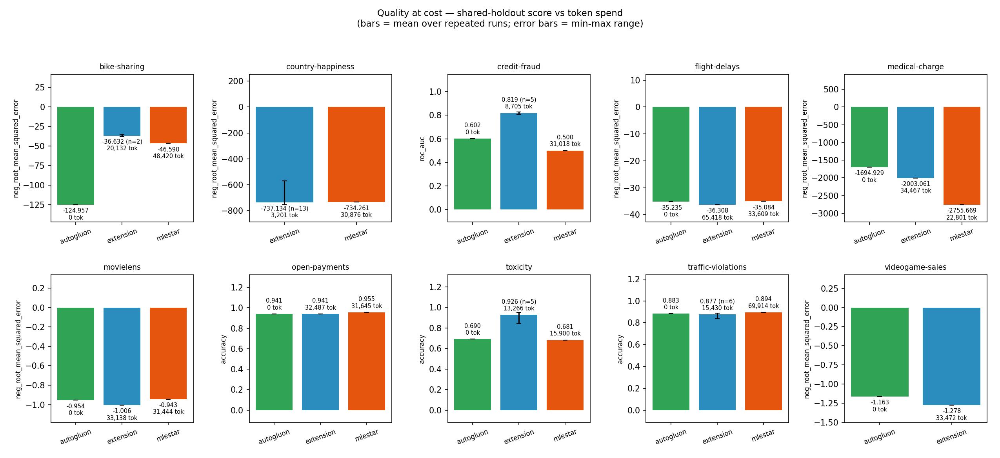
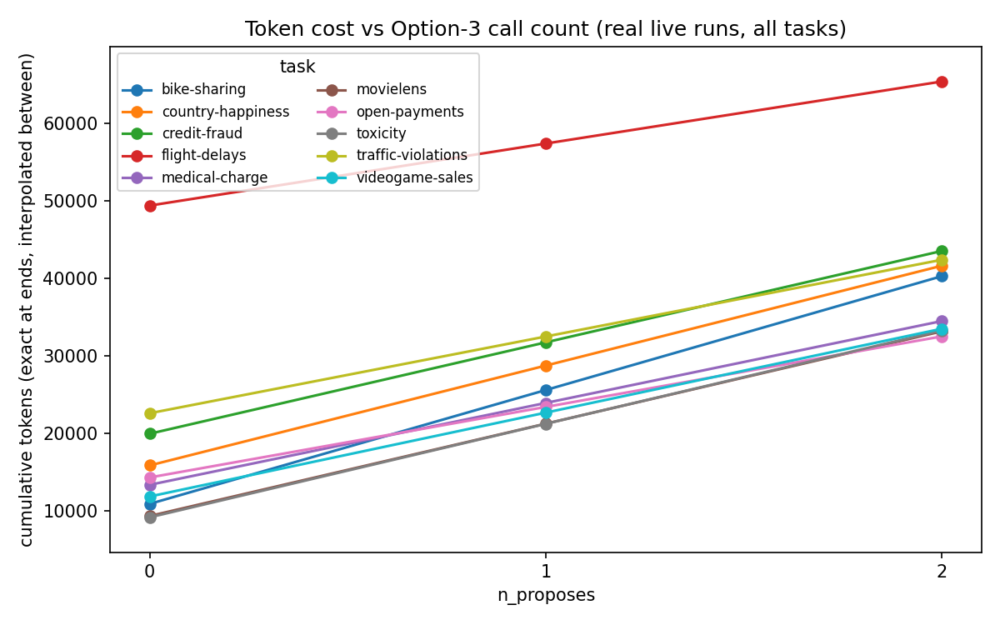
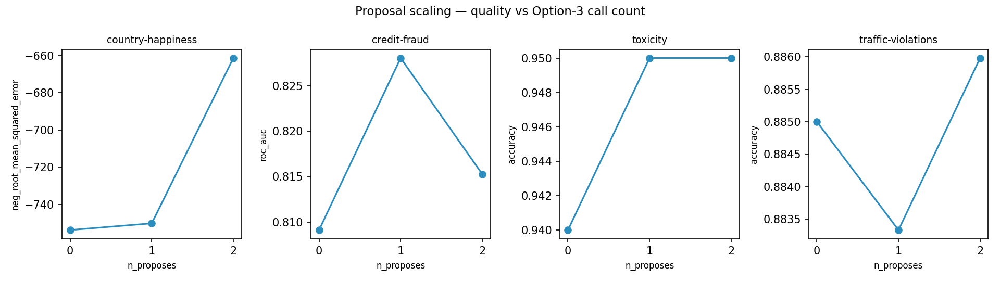

# EXPERIMENTAL_RESULTS.md

A discussion of the benchmark results. The underlying data is in the repository:
`figures/comparison.csv` (the flat table behind every figure), the per-run `result.json`
artifacts under `results/`, and the rendered figures under `figures/`. To reproduce, see
[`EXPERIMENTS.md`](EXPERIMENTS.md).

---

## Heads-up before reading the numbers

Four things to keep in mind — the first is the single biggest factor for reproducibility.

1. **The LLM can author a completely different plan from the same data digest.** The agents are
   the only non-deterministic component: a re-run with the *same task, same budget, same config*
   can produce a different search space and therefore a different result. Toxicity is the prime
   example — two live runs with identical configuration: in one the plan_author did **not**
   recommend skrub's `TextEncoder` and the run reached **0.845** accuracy; in the other it did,
   and the run reached **0.945**. A 0.10 accuracy swing from plan authorship alone, before the
   search did anything different. Everything *downstream* of the plan is deterministic (seeded
   subsamples, seeded estimators, exact score cache), which is why `scripts/replay_from_run.py`
   exists: a replay pins the captured plan and reproduces the search bit-for-bit at zero API
   cost. Reproducing a *live* result therefore means reproducing its plan — quote results
   together with their captured `spec_raw`, and expect fresh live runs to vary.

2. **The shipped extension numbers carry a small optimistic selection bias.** They predate the
   on-disk train/holdout split fix (commit `517f954`): until then the search cross-validated
   over rows that later became its own 25% holdout, so it *chose* its pipeline with the eval
   rows visible, while AutoGluon only ever saw the 75%. The bias is one-directional — the
   extension − AutoGluon delta is an upper bound — and we have since **measured it** with
   zero-quota fixed-split replays of four tasks' captured plans (same plan, budget and
   proposals as each archive):

   | Task | Archived (biased) | Clean replay | Δ | Reading |
   |---|---|---|---|---|
   | credit-fraud (roc_auc) | 0.826 (archive min 0.809) | **0.807** | −0.015 | **Conclusive**: below every archived run → real optimism. |
   | traffic-violations (accuracy) | 0.885 | 0.888 | +0.002 | Within noise. |
   | bike-sharing (neg RMSE) | −38.0 | −35.3 | +2.7 | Moved *better* when clean — noise dominates. |
   | country-happiness (neg RMSE) | −754 | −569 | +185 | 117 rows: variance dwarfs any bias. |

   So: real, but smaller than per-task run-to-run variance on 3 of the 4 probes; only
   credit-fraud resolves it cleanly (~0.015 roc_auc, in the predicted direction). The code is
   fixed — any fresh run with `ensemble.selection == "oof_3fold"` is clean. Full write-up:
   [`docs/PROJECT_STATE.md § Hand-off`](docs/PROJECT_STATE.md#hand-off--the-published-numbers-are-biased),
   `docs/BUG_LEDGER.md` #26–#29.

3. **The three arms are scored on different bases.** Extension and AutoGluon share the seeded
   holdout (with the caveat above); the archived MLE-STAR runs predate the targeted `test.csv`
   and report **their own internal validation** — self-reported, indicative bars, not a
   like-for-like holdout comparison. The extension-vs-AutoGluon numbers are the comparable pair.

4. **All numbers here are the incumbent `holdout` score, never `ensemble_score`.** The archived
   Caruana-era ensemble selected its members on the same rows it reported (a greedy maximum over
   the published metric — since fixed to out-of-fold selection); the incumbent carries only the
   bias of point 2.

---

## Headline results (shared-holdout score per task)

Lower-is-better metrics (RMSE) are shown negated, so **higher is always better**. Best value
per row in **bold** (only where the arms are comparable). Source: `figures/comparison.csv`.

Tasks marked ⛓ are **relational** (they ship `aux_*.csv` tables the extension can aggregate-join;
the flat-table baselines cannot). The four are `country-happiness`, `credit-fraud`,
`flight-delays`, `movielens` — but the amount of signal in the flat table varies enormously
(see the discussion below), which is why relational capability does *not* translate to a win on
every one of them.

| Task | Metric | Extension | AutoGluon | MLE-STAR* |
|---|---|---|---|---|
| bike-sharing | neg RMSE | **−38.00** | −124.96 | −46.59 |
| country-happiness ⛓ | neg RMSE | −753.87 | **✗ can't run**‡ | −734.26 |
| credit-fraud ⛓ | roc_auc | **0.826** | 0.602 | 0.500 |
| flight-delays ⛓ | neg RMSE | −36.31 | **−35.24** | −35.08 |
| medical-charge | neg RMSE | −2003.1 | **−1694.9** | −2755.7 |
| movielens ⛓ | neg RMSE | −1.006 | **−0.954** | −0.943 |
| open-payments | accuracy | 0.941 | 0.941 | **0.955** |
| toxicity *(text)* | accuracy | **0.945** | 0.690 | 0.681 |
| traffic-violations | accuracy | **0.885** | 0.883 | 0.894 |
| videogame-sales | neg RMSE | −1.278 | **−1.163** | **✗ no runnable script**§ |

\* MLE-STAR column is **self-reported internal validation**, not the shared holdout (heads-up 3)
— do not read it as like-for-like.

‡ **AutoGluon cannot run country-happiness.** The predictive signal lives in the aggregation of
the relational `aux_*.csv` tables; without that join the flat table AutoGluon sees is just a
string identifier column and the target, so there is no signal to fit. This is the same
structural blind spot as credit-fraud — a *capability* gap, not a lost race. (country-happiness
is therefore a second relational task, not a plain regression one.)

§ **MLE-STAR failed to produce a runnable script for videogame-sales** within its API-call cap.
MLE-STAR's runs are bounded by the number of LLM calls (`MAX_CALLS`); when the code-and-debug
cascade does not converge on an executable submission before the cap, the run is recorded as a
**failure**. We report these failures rather than hide them — an unbounded-cost method that does
not finish within a budget *is* a result about the method.

---

## What the numbers say

### 1. The structural wins are the real story (and the ones the bias does *not* touch)

The relational tasks are the differentiator, but they are **not** a clean sweep — the deciding
factor is *how much signal survives in the flat table* once the aux tables are removed. The four
sit on a spectrum:

- **country-happiness — no flat signal → AutoGluon cannot run it.** The main table is
  `(Country, happiness_score)`: a single string identifier and the target, 117 rows. *All*
  signal must arrive through the aggregate joins on the three World-Bank aux tables. The
  extension's `AggJoiner` stage constructs those features and fits them (−753.87 RMSE);
  AutoGluon has nothing to fit. This is the strongest possible form of a capability gap — not a
  worse score, but **no score**.
- **credit-fraud — ID carries weak signal; aggregation is the real boost.** The main table is
  `(ID, fraud_flag)`. AutoGluon recovers a *partial* signal from the ID column alone
  (roc_auc 0.602) — IDs are not pure noise — but the predictive lift is in aggregating the
  `aux_products.csv` basket contents, which only the extension can reach: **0.826 vs 0.602**.
  This is the clearest quantified relational win.
- **movielens & flight-delays — enough flat signal that AutoGluon matches or wins anyway.** On
  movielens the main table is pure IDs `(userId, movieId, rating)`, yet AutoGluon extracts
  enough from ID statistics to score −0.954, *ahead* of the extension's −1.006 even though the
  extension can aggregate `aux_movies.csv`. On flight-delays the flat table is already rich
  (carrier, scheduled times, origin/dest, distance), so the `aux_airports.csv` join is a
  marginal add and AutoGluon's mature flat modelling wins (−35.24 vs −36.31). **Relational
  capability is necessary but not sufficient: where the flat table already carries the signal,
  AutoGluon's stacking is hard to beat.**

Alongside the relational axis, the two non-relational wins come from the **flexibility of the
LLM-authored space** — and in both cases the winning configuration names the mechanism:

- **toxicity (text): 0.945 vs AutoGluon 0.690 accuracy.** The win is the freedom to *choose the
  text encoder*: the plan offered skrub's `TextEncoder` (sentence-embedding backbone) as a
  scoped per-column option, and the search selected it (`scope_text_encoder: TextEncoder` +
  `LinearSVC` in the winning state). AutoGluon's default pipeline never reaches an embedding
  encoder for this column.
- **bike-sharing: −38.0 vs AutoGluon −125.0 RMSE.** The win most likely comes from *extracting
  the weekday from the date column* — a large-signal feature for hourly rental demand. The
  winning state has `DatetimeEncoder` with `add_weekday=True` (in both the vectorizer's datetime
  slot and a scoped `date_expansion` group). AutoGluon's default preprocessing did not surface
  this cyclical structure.

The honest headline: **every clear extension win has an identifiable structural mechanism** —
relational aggregation where the flat table is signal-starved (country-happiness, credit-fraud),
and authored-space flexibility that reaches a transformation the fixed pipeline lacks (text
embeddings on toxicity, weekday extraction on bike-sharing). That capability is a *ceiling
raise*, not a guaranteed win: where the flat table is already informative (movielens,
flight-delays, medical-charge), AutoGluon's stacking still edges ahead. The mechanism-backed
wins are the ones that survive every heads-up above — they are structural effects, not
score-selection effects, and two of them (bike-sharing, traffic-violations) were additionally
re-confirmed on the clean fixed split by the replays in heads-up 2.

### 2. On flat tabular tasks the picture is mixed — and the bias makes AutoGluon's wins strong

On the plain tabular regression tasks (flight-delays, medical-charge, movielens,
videogame-sales) **AutoGluon wins**, and it wins *despite* the extension enjoying the optimistic
selection bias. That makes those AutoGluon wins the more trustworthy of the two directions:
a clean-selection arm beating an optimistically-selected arm is a lower bound on AutoGluon's
true edge there. AutoGluon's mature bagging + stacking of many model families is hard to beat
on well-behaved flat tables with a single incumbent pipeline. bike-sharing is the exception
(extension −38.0 vs −124.96) — its strongly cyclical/temporal structure suits the extension's
`DatetimeEncoder` scoped-group path, which AutoGluon's default preprocessing does not capture.

On the classification tasks the two are close (open-payments a tie at 0.941; traffic-violations
0.885 vs 0.883 — and the extension's clean fixed-split replay, 0.888, holds that edge).

### 3. The token-cost axis — the design's central claim — is measured and unbiased

This is the axis the split bug does **not** touch, and it is the point of the whole design.
From `comparison.csv` (`tokens` / `llm_calls`):

- **Extension:** a small, **fixed** LLM cost — **2 calls** per task (`data_analyst` +
  `plan_author`), plus 1 per Extended Feature 3 proposal, measured at roughly **30k–65k tokens** for a
  whole task. Crucially, this is **constant in the search budget**: a `BUDGET=20` run and a
  `TIME_BUDGET=3600` run cost the *same* tokens. You buy quality with CPU time, not tokens.
- **MLE-STAR:** the token cost is **unbounded by construction** — it writes and debugs code, so
  cost scales with the number of code-and-debug LLM calls (a data-dependent cascade). Our arm
  only runs at all because it is hard-capped (`MAX_CALLS`); uncapped it can reach 1000+ calls.
  The flip side of that cap is **reliability**: on videogame-sales MLE-STAR did not converge on
  a runnable script before hitting the call limit, so that task is a **failure**, not a score.
  This is intrinsic to the code-generation approach — under a fixed budget it sometimes returns
  nothing executable, whereas the extension's structured-plan approach cannot emit a
  non-runnable pipeline (the space is validated and every node is a complete, evaluable config).
- **AutoGluon:** zero LLM cost (no LLM), but zero relational/adaptive capability either.

Plotted below, the extension sits at a fixed, cheap x no matter how much search it does;
MLE-STAR trails off to the right; AutoGluon sits at the origin. **Constant, known token cost
that does not grow with search depth** is the property the extension is designed to have, and
it is the one result here that is fully clean.

### 4. Extended Feature 3 injection: real upside, high variance

The controlled measurement is the replay series: `replay_from_run.py` re-runs one task's
captured plan at N = 0, 1, 2 of its *real logged* proposals, everything else held identical —
so the only moving part is how many mid-search plan extensions the search received.

The per-task series (also in `figures/comparison.csv`, the zero-token rows):

| Task | N=0 | N=1 | N=2 | Shape |
|---|---|---|---|---|
| credit-fraud (roc_auc) | 0.809 | 0.828 | 0.824 | improves, then slightly regresses |
| toxicity (accuracy) | 0.940 | 0.950 | 0.950 | improves, then flat |
| traffic-violations (accuracy) | 0.885 | 0.883 | 0.884 | dips, partially recovers |
| country-happiness (neg RMSE) | −753.9 | −753.9 | −753.9 | flat — injections never displaced the incumbent |

Each proposal costs exactly **+1 LLM call**, so the axis stays within the O(1) budget — but the
*return* on that call is **high-variance, for the same reason live plans are (heads-up 1): the
proposal is LLM-authored.** A proposal step sometimes lands an operator the search adopts
(credit-fraud's +0.019 at N=1; the country-happiness A/B where an injected QuantileTransformer
carried the ensemble from −753.9 to −717.0), sometimes injects options that only dilute the
budget across a wider space (credit-fraud N=1→2, traffic-violations N=0→1), and sometimes
changes nothing at all (country-happiness's flat series — the injected operators never beat the
incumbent). Monotonic improvement should **not** be expected from more proposals: the mechanism
is a cheap lottery ticket on a missing operator, valuable when the initial plan missed something
(exactly the toxicity-TextEncoder failure mode of heads-up 1), roughly neutral-to-noisy when the
initial plan was already adequate.

---

## Summary

- **Where the extension clearly wins, the mechanism is identifiable** — relational aggregation
  on the signal-starved tasks (country-happiness, where AutoGluon *can't run*; credit-fraud),
  and authored-space flexibility elsewhere: the freedom to pick a text embedding encoder
  (toxicity) and to extract the weekday from a date column (bike-sharing). These are *capability*
  gaps, immune to the selection bias.
- **The selection bias is measured, small, and disclosed** — a 4-task zero-quota replay probe
  resolves it cleanly only on credit-fraud (~0.015 roc_auc, optimistic as predicted); on the
  other three it is smaller than run-to-run variance.
- **Relational capability is a ceiling raise, not a guaranteed win.** Of the 4 relational tasks,
  the extension only wins the 2 where the flat table is starved of signal; on the 2 where IDs or
  flat features already carry signal (movielens, flight-delays) AutoGluon's stacking still edges
  ahead despite being aux-blind.
- **On plain flat tables AutoGluon is competitive or better**, and because it selects cleanly
  while the extension does not, those AutoGluon results are the trustworthy direction.
- **The baselines' failure modes are themselves results:** AutoGluon is aux-blind on all 4
  relational tasks and *cannot run at all* on the one with no flat signal (country-happiness);
  MLE-STAR — bounded by API calls — sometimes returns no runnable script (videogame-sales). The
  extension's validated-plan design cannot produce either failure.
- **The token-cost story is the clean, central result:** a fixed, small, known LLM cost that is
  constant in search depth, versus MLE-STAR's unbounded code-and-debug cascade.
- **Reproducing a live number means reproducing its plan.** The LLM's plan is the one
  non-deterministic input (heads-up 1 — toxicity's 0.845-vs-0.945 swing hinged on whether
  `TextEncoder` was recommended); everything downstream is seeded, and `replay_from_run.py`
  reproduces any archived run bit-for-bit from its captured plan.
- **Extended Feature 3 shares that variance** — proposals are LLM-authored, so extra proposal
  steps sometimes improve, sometimes regress, sometimes change nothing (§4); expect a cheap
  option on a missed operator, not monotonic gains.
- **The extension's quality numbers are optimistic upper bounds (measured small)**, and
  MLE-STAR's are self-reported on its own split — a fully clean three-way holdout comparison
  remains owed and was blocked by end-of-project API availability. The code is fixed; a fresh
  run (`selection == "oof_3fold"`) is clean.
